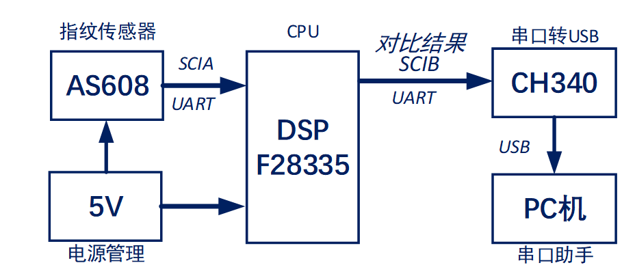
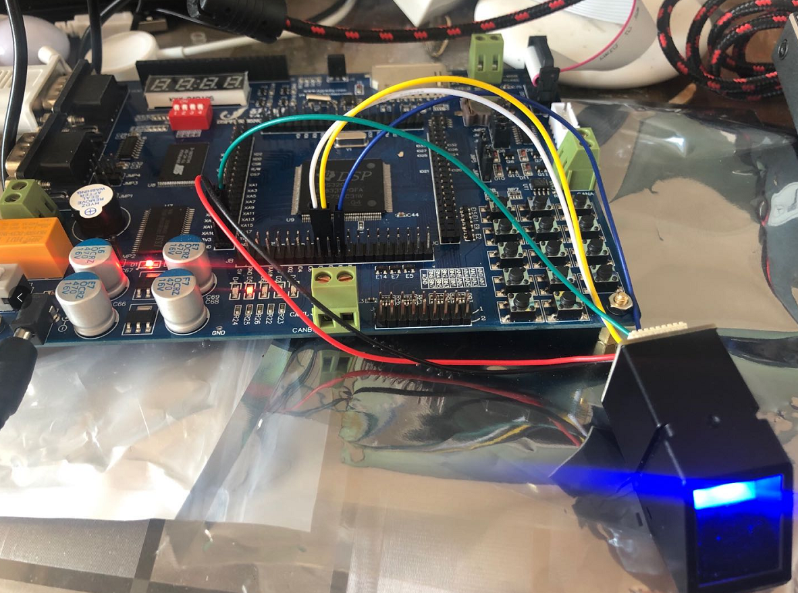

# 基于DSP指纹模块识别

## 1.1 整体架构设计

根据需求方表述，要求设计一套“**基于TMS320F28335****（简称28335）指纹识别**”系统，项目内部代码"S04"。功能为：**以28335开发板为核心进行开发，实现指纹的存储和比对识别。**

## 1.2 需求解析

### 设计要求

*  TMS320F28335的型号DSP作为处理器。

* 选择光学指纹模块对指纹信息进行采集。

* 实现指纹的存储和识别功能。

### 采用方案

* 拟采用主TMS320F28335进行嵌入式编程，对主CPU（STM32F103系列芯片）进行嵌入式编程，包含配置TMS320F28335的系统，搭建硬件运行环境，对整体系统运行架构，协议，算法，流程设计，要求包含完整的工程开发库文件。如图1所示。

* 指纹模块拟采用AS608光学指纹识别模块，其主要特征为：模块通讯接口为USB和UART两种通信接口，本项目使用UART接口作为通信接口，与DSP的SCI接口相连；指纹图像录入时间：＜1.0秒；供电电压： DC 3.3V，供电电流： 工作电流：<60mA。，峰值电流：<60mA；窗口面积： 15.3╳ 18.2 mm；分辨率：500dpi。满足设计需求。

* 本项目匹配结果拟采用PC机的串口助手接收。若匹配成功，在串口助手接收版面显示指纹已匹配；若匹配失败，在串口助手接收版面显示匹配失败；若指纹采集失败，则提示用户重新按压指纹。

  

### 驱动开发

以嵌入式TMS320F28335系统为控制核心，开发包含：（1）指纹模块驱动、（2）串口驱动（3）上位机通信模块驱动。

## 1.3  实物图

